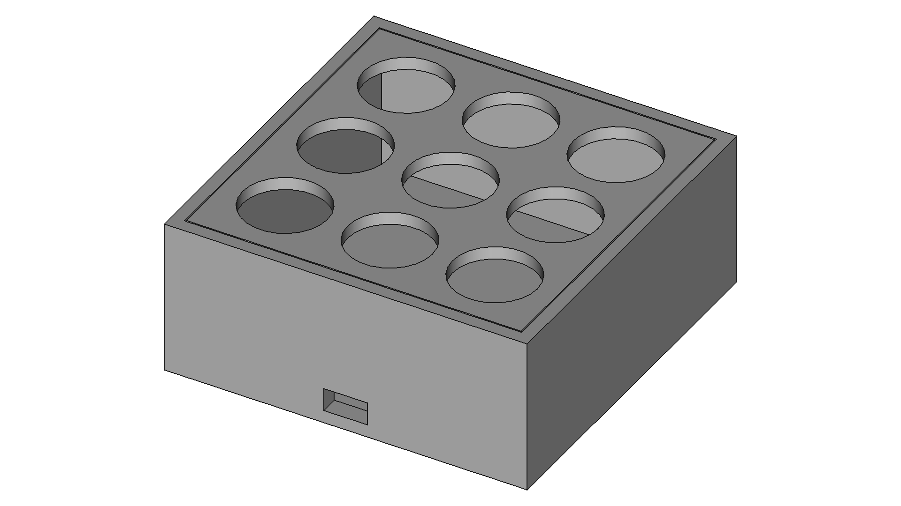

# mcrpd

## Overview

This is a customizable macro keypad I have designed and built.

## Dependencies

I generally try to minimize dependencies, but I'm a one man crew and can therefore only support Linux Mint/Ubuntu as I'm running it myself. Anyway, you need to have the following packages installed for everything to work properly:

- FreeCAD for editing and exporting the CAD files. Install it with `sudo apt install freecad`.
- A2Plus for assemblying the different components in FreeCAD. Install it via the integrated addon manager.
- Arduino IDE as a way to compile the Arduino code. Install it with `sudo apt install arduino`.

## How to build it

In the default configuration mcrpd's electronics consist of an Arduino Pro Micro and 9 tactile push buttons all housed in a 3D printed enclosure, but feel free customize the CAD model for housing even more buttons or a totally different microcontroller. After then wiring the buttons up in a pull-down-multiplexing-matrix everything is simply assembled using instant glue.

Below is a full bill of materials with German sources for all non-printable parts:

| Quantity: | Item: | Source: |
| --- | --- | --- |
| 1 | Instant glue | [Amazon](https://www.amazon.de/Pattex-Sekundenkleber-L%C3%B6sungsmittelfreier-Gel-Kleber-Transparent/dp/B00O23B8IE) |
| 1 | Cables | [Amazon](https://www.amazon.de/Donau-Elektronik-GMBH-Original-Kupfer/dp/B01BI1G88C) |
| 9 | Tactile push buttons | [Amazon](https://www.amazon.de/PsmGoods-Momentary-Aus-Taster-Schalter-Black/dp/B01MXHXON6) |
| 1 | Arduino Pro Micro | [Amazon](https://www.amazon.de/Micro-ATmega32U4-Arduino-Leonardo-%C3%A4hnlich/dp/B01D0OI90U) |

## How to change the macros

As all macros are hard programmed, you need to modify the firmware file `mcrpd.ino` and then reflash it using the Arduino IDE in order to change them. For realizing your specific macros follow the [keyboard library guide](https://www.arduino.cc/reference/en/language/functions/usb/keyboard/) from the Arduino Foundation and paste your snippets into the different cases defined in the switch statement.
